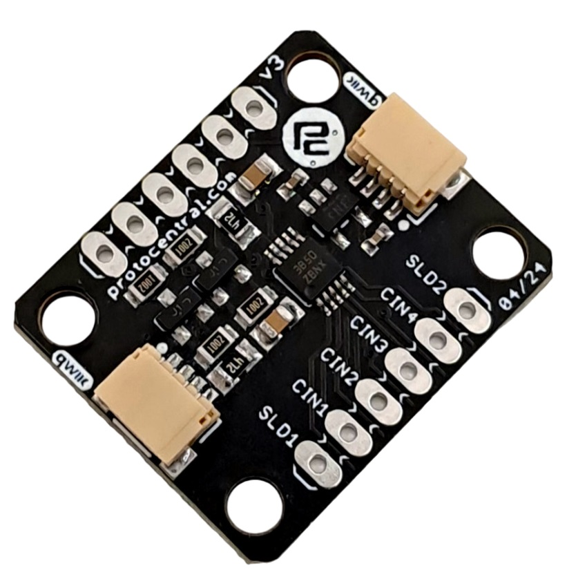

ProtoCentral FDC1004 capacitance sensor breakout board
================================
  

If you don't already have one, you can buy the ProtoCentral FDC1004 breakout board from:

* [ProtoCentral(Worldwide)](https://www.protocentral.com/gasliquid/1082-fdc1004-capacitance-converter-breakout-board-0642078949616.html)

* [ProtoCentral USA](https://protocentral.us/breakout-boards/9-prototypical-fdc1004-capacitance-sensor-breakout-board.html)

The FDC1004 is a single-chip IC for capacitance measurement for application including proximity sensing and liquid level sensing. This is based on the concept of measuring capacitance of an electrode with respect to ground.

This breakout board contains everything to connect it to an Arduino's I2C pins and it can be connected to any other platform with support for I2C two-wire interfaces.

We have made several cool projects with it including proximity sensing and liquid-level sensing from the outside of a tank. Check out our [Hackster page](https://www.hackster.io/team-protocentral/non-contact-capacitive-liquid-level-sensing-using-fdc1004-9333c7) for the detailed project description.

## Features

* Breakout contains the Texas Instruments FDC1004 IC
* 4 channel measurement
* On-board 3.3V voltage regulator
* Output data rates up to 400 Samples/second
* Easy-to-use I2C interface

## Specifications
* Capacitance measurement range: +/- 15 pF
* Resolution: 0.5 fF
* Maximum offset capacitance: 100 pF

## Includes
* 1x ProtoCentral FDC1004 Capacitance Sensor Breakout Board
* 1x Set of breakaway headers

## Repository Contents

* **/software** - Arduino library and example sketch
* **/hardware** - All Eagle design files (.brd, .sch)

## Connecting the breakout to an Arduino

Wire the FDC1004 breakout to an Arduino Uno using the following connections.

    Arduino   FDC1004 board
    -------   -------------
         5V <-> VCC
        GND <-> GND
         A4 <-> SDA
         A5 <-> SCL

##  Uploading Arduino Sketch For FDC1004 breakout

1. Open the Arduino IDE to load the embedded code for Protocentral_FDC1004.

2. Click on File -> Open and Browse the .ino code for Arduino from Protocentral_FDC1004-master\arduino and export the application to Arduino.

3.  Open serial terminal window, you should see the capacitance values obtained from the FDC1004 Breakout Board.

# License Information

This product is open source! Both, our hardware and software are open source and licensed under the following licenses:

## Hardware
**All hardware is released under [Creative Commons Share-alike 4.0 International](http://creativecommons.org/licenses/by-sa/4.0/).**

## Software
**All software is released under the MIT License(http://opensource.org/licenses/MIT).**

Please check [*LICENSE.md*](LICENSE.md) for detailed license descriptions.
